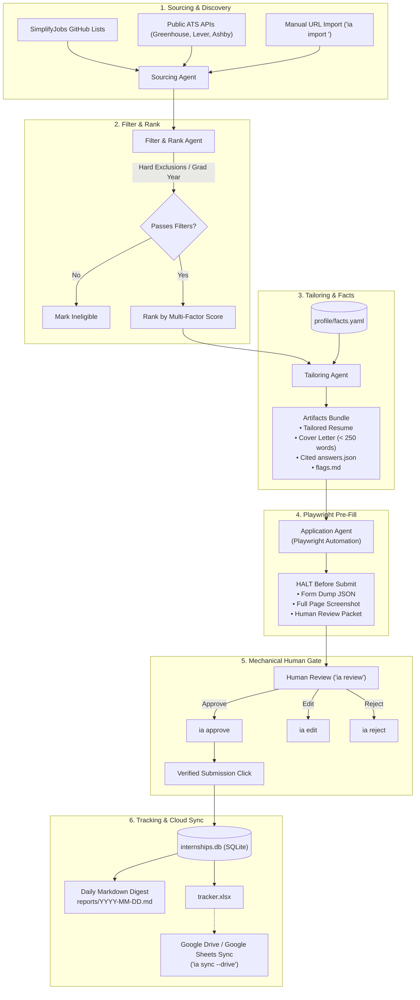

# 🚀 Internship Application Assistant (Summer 2027)

A semi-automated, privacy-first multi-agent assistant designed to discover, score, tailor, pre-fill, and track applications for **Summer 2027 Software Engineering & Quantitative Trading Internships**.

Built with **Python**, **Typer**, **Playwright**, **SQLAlchemy (SQLite)**, and **Rich**.

---

## 🌟 Philosophy & Core Guarantees

1. **Semi-Automatic Human Gate**:
   - Agents autonomously discover postings, score opportunities, tailor resumes, and pre-fill online ATS forms.
   - **Zero automated submissions**: The final submit button click is intercepted and mechanically blocked by a database verification hook until you explicitly run `ia approve <job_id>`.
2. **Zero Fabrication / Verifiable Facts Bank**:
   - Cover letters and free-text answers are strictly generated by citing atomic claims from your local `profile/facts.yaml`.
   - If an application asks a question unsupported by your facts bank, the system explicitly outputs:
     `[NEEDS INPUT: <Candidate> facts bank does not contain verifiable claims for question...]`
3. **100% Private & Local**:
   - Your name, resume PDF, contact info, notes, and local SQLite database stay on your local machine.
   - Airtight `.gitignore` ensures zero personal data or cloud credentials can be accidentally committed to Git.
4. **Multi-Factor Scoring & Ranking**:
   - Evaluates roles against your target graduation year, hard exclusions (e.g. government clearance, non-SWE roles), location preferences, and skill overlap.
5. **Auditable SQLite Pipeline**:
   - Every single status transition, review packet, form dump, and approval is logged with deterministic event timestamps.

---

## 🏗️ Architecture & Pipeline Flow



---

## ⚡ Quickstart Guide

### 1. Prerequisites
- **macOS** or **Linux**
- **Python 3.10+** (Python 3.11, 3.12, 3.13, 3.14 supported)
- **Git**

### 2. Clone and Setup Environment
```bash
# Clone the repository
git clone https://github.com/your-username/Internship-Application-2027.git
cd Internship-Application-2027

# Create and activate virtual environment
python3 -m venv .venv
source .venv/bin/activate

# Install dependencies and local CLI
pip install -e .

# Install Playwright browser binary
playwright install chromium
```

### 3. Run the Onboarding Setup Wizard
Run the interactive onboarding wizard to configure your profile, facts bank, and empty database:
```bash
./ia init
```
The wizard will:
- Guide you through entering your name, university, major, graduation year, GPA, contact info, and links into `profile/profile.yaml`.
- Initialize your verifiable facts bank (`profile/facts.yaml`).
- Create starter resume variants in `profile/variants/`.
- Initialize the local SQLite database (`internships.db`).

*(Tip: To initialize with example defaults non-interactively, run `./ia init --non-interactive`)*

### 4. Add Your Resume PDF
Place your master PDF resume in the `profile/` folder (e.g. `profile/resume.pdf`).

---

## 🛠️ Configuration & Customization

### 1. `profile/profile.yaml`
Stores your personal details used by Playwright to fill form inputs. **Never committed to Git.**
```yaml
personal:
  first_name: "Jane"
  last_name: "Doe"
  full_name: "Jane Doe"
  email: "jane.doe@university.edu"
  phone: "(555) 123-4567"
  address:
    street: "123 University Ave"
    city: "San Francisco"
    state: "CA"
    postal_code: "94107"

education:
  institution: "State University"
  degree: "Bachelor of Science"
  major: "Computer Science"
  gpa: "3.85"
  graduation_expected: "May 2028"
  class_year: "Class of 2028"

work_authorization:
  us_citizen: true
  authorized_to_work_in_us: true
  requires_sponsorship: false

links:
  github: "https://github.com/janedoe"
  linkedin: "https://linkedin.com/in/janedoe"
  portfolio: "https://janedoe.dev"
```

### 2. `profile/facts.yaml` (The Facts Bank)
Every project, role, metric, course, and skill you are willing to claim is cataloged here with an atomic ID. The agent will **only** generate answers citing these IDs:
```yaml
candidate:
  id: "cand.user"
  name: "Jane Doe"
  school: "State University"

education:
  - id: "edu.university.bs"
    institution: "State University"
    degree: "B.S. in Computer Science"
    gpa: "3.85/4.00"

projects:
  - id: "proj.distributed_kv"
    title: "Distributed Key-Value Store"
    technologies: ["C++20", "gRPC", "Protobuf", "Docker"]
    bullets:
      - id: "proj.kv.b1"
        text: "Engineered a fault-tolerant key-value store implementing the Raft consensus algorithm."

skills:
  languages:
    - id: "skill.lang.cpp"
      name: "C++"
    - id: "skill.lang.python"
      name: "Python"
```

### 3. `profile/variants/` (Markdown Resume Variants)
Templates in this directory (`general.md`, `systems.md`, `quant.md`) are customized for different role categories. Tailoring bundles pull from the best-matched variant for each posting.

### 4. `config/companies.yaml` & `config/filters.yaml`
- `config/companies.yaml`: Directory of 50+ target top tech firms, quant trading firms, and fintech companies with verified ATS endpoints (Greenhouse, Lever, Ashby, Workday, SmartRecruiters).
- `config/filters.yaml`: Define target terms ("Summer 2027"), location tiers, excluded keywords (e.g. IT support, clearance), and daily budget caps.

---

## 💻 CLI Command Reference

Execute commands using `./ia <command>` (or `python cli.py <command>`):

| Command | Description | Example |
| :--- | :--- | :--- |
| `ia init` | Run interactive setup wizard to configure profile & database | `./ia init` |
| `ia status` | Display candidate profile, company ATS coverage, and pipeline status | `./ia status` |
| `ia source` | Discover new internship postings across GitHub lists & ATS APIs | `./ia source` |
| `ia rank` | Evaluate hard filters and compute multi-factor ranking scores | `./ia rank --limit 15` |
| `ia tailor <job_id\|all>` | Generate tailored bundle (resume variant, cover letter, cited answers) | `./ia tailor job_123` |
| `ia apply <job_id>` | Pre-fill ATS form with Playwright, dump form, and **halt before submit** | `./ia apply job_123` |
| `ia review` | Display table of applications currently halted and awaiting human review | `./ia review` |
| `ia approve <job_id>` | Grant human approval and execute verified application submission | `./ia approve job_123` |
| `ia edit <job_id> <f> <v>` | Modify a pre-filled form field before granting submission approval | `./ia edit job_123 email me@vandy.edu` |
| `ia reject <job_id>` | Mark an opportunity as skipped / archived with a documented reason | `./ia reject job_123 --reason "Relocation"` |
| `ia digest` | Generate daily markdown digest (`reports/YYYY-MM-DD.md`) and update Excel | `./ia digest` |
| `ia export` | Export entire local application database to formatted `tracker.xlsx` | `./ia export` |
| `ia sync` | Sync Excel tracker and database snapshot to Google Drive / Sheets | `./ia sync --drive` |
| `ia import <url>` | Manually import an external posting (e.g. from LinkedIn or Handshake) | `./ia import https://jobs.lever.co/...` |
| `ia budget` | View daily LLM spend, remaining budget, and rate limit status | `./ia budget` |
| `ia verify` | Re-verify ATS tokens and endpoints for all target companies | `./ia verify` |

---

## ⏰ Automated Daily Scheduling

The assistant includes a daily runner script (`scripts/daily_digest.sh`) that automates sourcing, scoring, generating the daily markdown digest, and cloud sync:

```bash
# Test runner manually
./scripts/daily_digest.sh
```

### Setting up a 4:00 AM Daily Cron Job
To run discovery and reporting automatically every morning at 4:00 AM:
```bash
crontab -e
```
Add the following line (adjusting to your cloned path):
```cron
0 4 * * * /bin/bash /path/to/Internship-Application-2027/scripts/daily_digest.sh > /dev/null 2>&1
```

*(On macOS, you can also use a `launchd` plist in `~/Library/LaunchAgents`)*.

---

## ☁️ Google Drive & Google Sheets Cloud Sync

You can automatically sync your Excel tracker into a live, collaborative **Google Spreadsheet** and backup your SQLite database snapshots:

1. **Setup**:
   ```bash
   ./ia sync --setup
   ```
2. **Configuration**:
   - Create a Google Cloud Service Account (or OAuth desktop client) with Google Drive & Google Sheets API enabled.
   - Save the key to `config/service_account.json` (or set `GDRIVE_SERVICE_ACCOUNT` in `.env`).
   - Set `GDRIVE_FOLDER_ID=your_folder_id` in `.env`.
   - Share your target Google Drive folder with your service account email as **Editor**.
3. **Verify & Sync**:
   ```bash
   ./ia sync --check
   ./ia sync --drive
   ```

---

## 🛡️ Privacy, Security & Anti-Hallucination Policy

- **No Remote Telemetry**: The assistant makes network requests **only** to public job boards (Greenhouse, Lever, Ashby, GitHub) and your designated Google Drive folder.
- **Strict Verification Hook**:
  - `agents/apply.py` will refuse to click submit buttons unless a matching `approval_granted` event signed by `actor="human"` exists in the SQLite database.
- **Git Ignored by Default**:
  - `*.db`, `*.sqlite`, `tracker.xlsx`, `profile/*.pdf`, `profile/profile.yaml`, `profile/facts.yaml`, `config/service_account*.json`, `.env`, and all generated form screenshots/dumps in `artifacts/` are strictly excluded in `.gitignore`.

---

## 🧪 Running Unit & Acceptance Tests

The codebase includes a comprehensive 44-test automated test suite covering all phases:

```bash
# Run the complete test suite
pytest tests/
```

---

## 📄 License

MIT License. Feel free to use, modify, and share with your friends!
