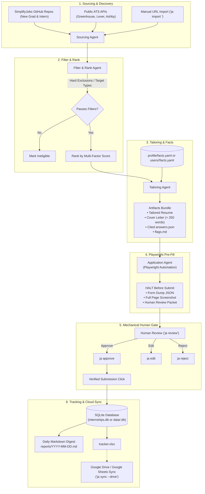

# 🚀 Software Engineering Job & Internship Application Assistant

A semi-automated, privacy-first multi-agent assistant designed to discover, score, tailor, pre-fill, and track applications for **Full-Time, New Grad, and Internship Software Engineering roles** (across Big Tech & AI, Quant Trading, Fintech, and High-Growth Tech).

Dual CLI commands: **`ja`** (*Job Assistant*) and **`ia`** (*Internship Assistant*).

Built with **Python**, **Typer**, **Playwright**, **SQLAlchemy (SQLite)**, and **Rich**.

---

## 🌟 Philosophy & Core Guarantees

1. **General Job Application Support (Full-Time, New Grad, Internships)**:
   - Configurable job search modes (`general`, `internship`, `new_grad`, `full_time`).
   - Sourcing across top tech lists (SimplifyJobs New Grad & Intern repos) and public ATS APIs (Greenhouse, Lever, Ashby, Workday, SmartRecruiters).
   - Dynamic seniority detection and graduation timing adaptation.
2. **Dedicated Multi-User Onboarding & Database Generation**:
   - Easily onboard new users with `./ja init --user <username>`.
   - Each individual user receives a dedicated, completely isolated database (`data/<username>.db`) and workspace (`users/<username>/`).
   - Zero interference with the default candidate pipeline (`internships.db`).
3. **Semi-Automatic Human Gate**:
   - Agents autonomously discover postings, score opportunities, tailor resumes, and pre-fill online ATS forms.
   - **Zero automated submissions**: The final submit button click is intercepted and mechanically blocked by a database verification hook until you explicitly run `ja approve <job_id>` (or `ia approve <job_id>`).
4. **Zero Fabrication / Verifiable Facts Bank**:
   - Cover letters and free-text answers are strictly generated by citing atomic claims from your local facts bank (`facts.yaml`).
   - If an application asks a question unsupported by your facts bank, the system explicitly outputs:
     `[NEEDS INPUT: <Candidate> facts bank does not contain verifiable claims for question...]`
5. **100% Private & Local**:
   - Your name, resume PDF, contact info, notes, and local SQLite databases stay on your local machine.
   - Airtight `.gitignore` ensures zero personal data (`users/*`, `data/*`, `*.db`, `profile/*.pdf`, `tracker.xlsx`) or cloud credentials can ever be committed to Git.
6. **Multi-Factor Scoring & Ranking**:
   - Evaluates roles against your target profile, hard exclusions (e.g. government clearance, non-SWE roles), location preferences, and skill overlap.
7. **Auditable SQLite Pipeline & Google Drive Sync**:
   - Every single status transition, review packet, form dump, and approval is logged with deterministic event timestamps.
   - Optional 2-way cloud backup and live Google Sheets tracker sync.

---

## 🏗️ Architecture & Pipeline Flow


```mermaid
flowchart TD
    subgraph Discovery ["1. Sourcing & Discovery"]
        A1["SimplifyJobs GitHub Repos (New Grad & Intern)"] --> S["Sourcing Agent"]
        A2["Public ATS APIs (Greenhouse, Lever, Ashby)"] --> S
        A3["Manual URL Import ('ja import <url>')"] --> S
    end

    subgraph Scoring ["2. Filter & Rank"]
        S --> R["Filter & Rank Agent"]
        R -->|"Hard Exclusions / Target Types"| F{"Passes Filters?"}
        F -- "No" --> DISC["Mark Ineligible"]
        F -- "Yes" --> QUAL["Rank by Multi-Factor Score"]
    end

    subgraph Tailoring ["3. Tailoring & Facts"]
        QUAL --> T["Tailoring Agent"]
        FACTS[("profile/facts.yaml or users/<user>/facts.yaml")] --> T
        T --> BUNDLE["Artifacts Bundle\n• Tailored Resume\n• Cover Letter (< 250 words)\n• Cited answers.json\n• flags.md"]
    end

    subgraph Fill ["4. Playwright Pre-Fill"]
        BUNDLE --> P["Application Agent\n(Playwright Automation)"]
        P --> HALT["HALT Before Submit\n• Form Dump JSON\n• Full Page Screenshot\n• Human Review Packet"]
    end

    subgraph ReviewGate ["5. Mechanical Human Gate"]
        HALT --> REV["Human Review ('ja review')"]
        REV -->|Approve| APP["ja approve <job_id>"]
        REV -->|Edit| EDIT["ja edit <field> <val>"]
        REV -->|Reject| REJ["ja reject <job_id>"]
        APP --> SUBMIT["Verified Submission Click"]
    end

    subgraph Tracking ["6. Tracking & Cloud Sync"]
        SUBMIT --> DB[("SQLite Database\n(internships.db or data/<user>.db)")]
        DB --> DIGEST["Daily Markdown Digest\nreports/YYYY-MM-DD.md"]
        DB --> EXCEL["tracker.xlsx"]
        EXCEL -.-> GDRIVE["Google Drive / Google Sheets Sync\n('ja sync --drive')"]
    end
```

---

## ⚡ Quickstart Guide

### 1. Prerequisites
- **macOS** or **Linux**
- **Python 3.10+** (Python 3.11, 3.12, 3.13, 3.14 supported)
- **Git**

### 2. Clone and Setup Environment
```bash
# Clone the repository
git clone https://github.com/CharleyGuo/internship-application-2027.git
cd internship-application-2027

# Create and activate virtual environment
python3 -m venv .venv
source .venv/bin/activate

# Install dependencies and local CLI
pip install -e .

# Install Playwright browser binary
playwright install chromium
```

### 3. Initialize Candidate Profile & Database

#### Default Profile (Preserves existing data & interview notes):
```bash
./ja init
# or: ./ia init
```

#### New User Profile (Generates dedicated isolated DB `data/<user>.db`):
```bash
./ja init --user alice
```

The interactive onboarding wizard will:
1. **Candidate Profile**: Guide you through entering your full name, email, phone, institution/company, major, graduation status, GPA, work authorization, and links.
2. **Resume Ingestion**: Prompt for your master resume PDF or Markdown file to import.
3. **Target Job Market**: Choose your target market:
   - `1) All (Full-Time, New Grad, Internship)`
   - `2) Internship only`
   - `3) Full-Time & New Grad only`
4. **Database Generation**: Automatically initializes a dedicated SQLite database (`data/alice.db` or `internships.db`) with schema for jobs, applications, scores, artifacts, and audit events.

*(Tip: To initialize with example templates non-interactively, run `./ja init --non-interactive`)*

---

## 💻 CLI Command Reference

Execute commands using `./ja <command>` or `./ia <command>` (supports `--user <name>` for multi-user workflows):

| Command | Description | Example |
| :--- | :--- | :--- |
| `ja init` | Run interactive setup wizard (profile, resume, target market, DB) | `./ja init --user alice` |
| `ja status` | Display candidate profile, company ATS coverage, and pipeline status | `./ja status` or `./ja --user alice status` |
| `ja source` | Discover new postings across GitHub lists & ATS APIs | `./ja source` |
| `ja rank` | Evaluate hard filters and compute multi-factor ranking scores | `./ja rank --limit 15` |
| `ja tailor <job_id\|all>` | Generate tailored bundle (resume variant, cover letter, cited answers) | `./ja tailor job_123` |
| `ja apply <job_id>` | Pre-fill ATS form with Playwright, dump form, and **halt before submit** | `./ja apply job_123` |
| `ja review` | Display table of applications currently halted and awaiting human review | `./ja review` |
| `ja approve <job_id>` | Grant human approval and execute verified application submission | `./ja approve job_123` |
| `ja edit <job_id> <f> <v>` | Modify a pre-filled form field before granting submission approval | `./ja edit job_123 email me@example.com` |
| `ja reject <job_id>` | Mark an opportunity as skipped / archived with a documented reason | `./ja reject job_123 --reason "Location"` |
| `ja digest` | Generate daily markdown digest (`reports/YYYY-MM-DD.md`) and update Excel | `./ja digest` |
| `ja export` | Export entire local application database to formatted `tracker.xlsx` | `./ja export` |
| `ja sync` | Sync Excel tracker and database snapshot to Google Drive / Sheets | `./ja sync --drive` |
| `ja import <url>` | Manually import an external posting (e.g. from LinkedIn or Handshake) | `./ja import https://jobs.lever.co/...` |
| `ja budget` | View daily LLM spend, remaining budget, and rate limit status | `./ja budget` |
| `ja verify` | Re-verify ATS tokens and endpoints for all target companies | `./ja verify` |

---

## 🛠️ Configuration & Multi-User Structure

```text
├── config/
│   ├── companies.yaml     # Directory of 50+ top tech, quant trading, and fintech firms
│   └── filters.yaml       # Default search mode, target terms, locations, exclusions
├── profile/               # Default candidate profile and verifiable facts bank
│   ├── profile.yaml       # Personal contact & education details (Git ignored)
│   ├── facts.yaml         # Verifiable claims bank (Git ignored)
│   └── variants/          # Specialized resume markdown variants
├── users/                 # Dedicated multi-user directories (Git ignored)
│   └── <username>/
│       ├── profile.yaml   # User's profile
│       ├── facts.yaml     # User's facts bank
│       ├── filters.yaml   # User's job market preferences
│       ├── variants/      # User's resume variants
│       ├── artifacts/     # User's pre-filled form dumps & review packets
│       └── reports/       # User's daily digests
├── data/                  # Dedicated user databases (Git ignored)
│   └── <username>.db      # User's isolated SQLite database
├── internships.db         # Default candidate SQLite database (Git ignored)
└── tracker.xlsx           # Styled multi-tab Excel spreadsheet snapshot (Git ignored)
```

---

## ⏰ Automated Daily Scheduling

The assistant includes a daily runner script (`scripts/daily_digest.sh`) that automates sourcing, scoring, generating the daily markdown digest, and cloud sync:

```bash
# Test runner manually
./scripts/daily_digest.sh
```

### Setting up a 4:00 AM Daily Cron Job
To run discovery and reporting automatically every morning at 4:00 AM:
```bash
crontab -e
```
Add the following line (adjusting to your cloned path):
```cron
0 4 * * * /bin/bash /path/to/internship-application-2027/scripts/daily_digest.sh > /dev/null 2>&1
```

*(On macOS, you can also use a `launchd` plist in `~/Library/LaunchAgents`)*.

---

## ☁️ Google Drive & Google Sheets Cloud Sync

You can automatically sync your Excel tracker into a live, collaborative **Google Spreadsheet** and backup your SQLite database snapshots:

1. **Setup**:
   ```bash
   ./ja sync --setup
   ```
2. **Configuration**:
   - Create a Google Cloud Service Account (or OAuth desktop client) with Google Drive & Google Sheets API enabled.
   - Save the key to `config/service_account.json` (or set `GDRIVE_SERVICE_ACCOUNT` in `.env`).
   - Set `GDRIVE_FOLDER_ID=your_folder_id` in `.env`.
   - Share your target Google Drive folder with your service account email as **Editor**.
3. **Verify & Sync**:
   ```bash
   ./ja sync --check
   ./ja sync --drive
   ```

---

## 🛡️ Privacy, Security & Anti-Hallucination Policy

- **Zero Remote Telemetry**: The assistant makes network requests **only** to public job boards (Greenhouse, Lever, Ashby, GitHub) and your designated Google Drive folder.
- **Strict Verification Hook**:
  - `agents/apply.py` will refuse to click submit buttons unless a matching `approval_granted` event signed by `actor="human"` exists in the SQLite database.
- **Git Ignored by Default**:
  - `*.db`, `data/*`, `users/*`, `tracker.xlsx`, `profile/*.pdf`, `profile/profile.yaml`, `profile/facts.yaml`, `config/service_account*.json`, `.env`, and all generated form screenshots/dumps in `artifacts/` are strictly excluded in `.gitignore`.

---

## 🧪 Running Automated Tests

The test suite covers multi-user database generation, general SWE & intern role matching, and end-to-end pipelines:

```bash
# Run the complete test suite
pytest tests/
```

---

## 📄 License

MIT License. Feel free to use, modify, and share with your friends!
